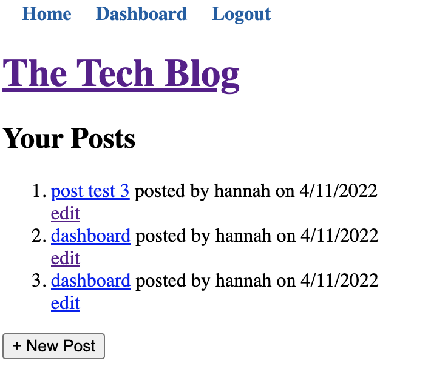

# Tech-Blog

## Description

This is a blog application. This application allows the user to create their own account, view created update and delete their posts as well as leave comments on others posts.

## Usage

The application is deployed and can be accessed via heroku link provided or if you installed application it can be accessed through your localhost network once app is initiated.

## Installation

- Option 1:
  Access with provided heroku link.

- Option 2:
  You must download the application code from the repository and clone it to your local machine. After the code has been cloned to your machine, you can then type 'npm install' in the directory of that repository to have access to the dependencies for this application to work.
  initialize app through console: npm start then open in your localhost:3001 network to interact with app.

## Links

[Deployed Site](https://ancient-cliffs-83099.herokuapp.com/)

[Link to Application Repository](https://github.com/ArmondR/Tech-Blog)

## Screenshot

### License

---

MIT License

Copyright (c) [2022] [Armond Rodriguez]

Permission is hereby granted, free of charge, to any person obtaining a copy
of this software and associated documentation files (the "Software"), to deal
in the Software without restriction, including without limitation the rights
to use, copy, modify, merge, publish, distribute, sublicense, and/or sell
copies of the Software, and to permit persons to whom the Software is
furnished to do so, subject to the following conditions:

The above copyright notice and this permission notice shall be included in all
copies or substantial portions of the Software.

THE SOFTWARE IS PROVIDED "AS IS", WITHOUT WARRANTY OF ANY KIND, EXPRESS OR
IMPLIED, INCLUDING BUT NOT LIMITED TO THE WARRANTIES OF MERCHANTABILITY,
FITNESS FOR A PARTICULAR PURPOSE AND NONINFRINGEMENT. IN NO EVENT SHALL THE
AUTHORS OR COPYRIGHT HOLDERS BE LIABLE FOR ANY CLAIM, DAMAGES OR OTHER
LIABILITY, WHETHER IN AN ACTION OF CONTRACT, TORT OR OTHERWISE, ARISING FROM,
OUT OF OR IN CONNECTION WITH THE SOFTWARE OR THE USE OR OTHER DEALINGS IN THE
SOFTWARE.

### Badges

---

